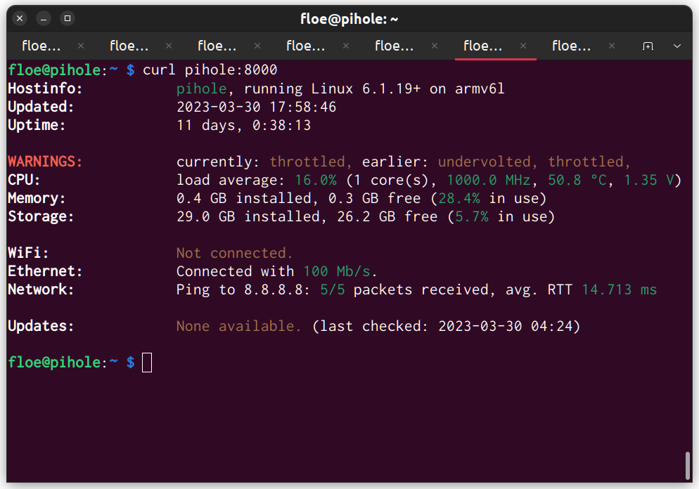

# nanosysinfo

I've got a few Raspberry Pi(e)s scattered around the house (webcam, pihole, etc.) and wanted a lightweight remote-capable system monitor for them. Most are still Gen 1 or Zero, so they are definitely resource-constrained. Of course, I googled around a fair bit, but only found either shell scripts purely for local console usage, or full-blown fleet management systems with databases and logging and whatnot.

So, obviously, I had to roll my own, and here you go. The only commandline switch is `-d` which will start the script in "daemon" mode, listening to HTTP requests on port 8000. Otherwise, you get the output directly on the console. As a little extra, if you poll the script remotely with `curl`, you will also get nicely coloured console output instead of HTML (which is otherwise the default for browsers).

For a quick install on any Pi, run `wget https://github.com/floe/nanosysinfo/raw/main/nanosysinfo.py`

And yes, I know you shouldn't screenscrape `apt` or `ping`, and `iwconfig` is deprecated. Yeah well. 🤷
